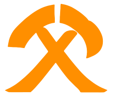

[项目网站]: https://konglingfei.com
[项目文档]: https://konglingfei.com/onex/
[安装指南]: https://konglingfei.com/onex/installation/
[开发指南]: https://konglingfei.com/onex/devel/devel.html
[功能列表]: https://konglingfei.com/onex/intro/feature.html

# OneX 云原生实战平台

<a href="https://konglingfei.com/"></a>

<div align="left">一个专为 Go + 云原生项目开发而生的开发脚手架</div>
<br/>

[](https://godoc.org/github.com/superproj/onex)
[](https://goreportcard.com/report/github.com/superproj/onex)
[](https://github.com/superproj/onex/blob/master/LICENSE)
[](https://goreportcard.com/report/github.com/superproj/onex)
[](https://pkg.go.dev/github.com/superproj/onex)
<br/>
[](https://github.com/superproj/onex/issues)
[](https://github.com/superproj/onex/actions/workflows/build-and-test.yml)
[](https://github.com/superproj/onex/tags)
[](https://github.com/superproj/onex/releases)
[](https://www.tickgit.com/browse?repo=github.com/superproj/onex)

<div align="center">
<strong>
<samp>

[简体中文](README.md) · [English](README.en.md)

[项目网站] | [项目文档] | [功能列表] | [安装指南] | [开发指南]

</samp>
</strong>
</div>

OneX 云原生实战平台是一个 Go 语言 + 云原生项目开发脚手架，也是一个企业级的云平台，整个项目遵循最佳实践的思路去构建。

OneX 项目通过提供功能完备、规范、高质量的 Go 源码来实现代码即学习的理念。

> OneX 寓意该实战项目具有功能全、扩展性高等特点。未来 OneX 会继续集成进很多跟 Go、云原生相关的功能。因为 OneX在项目设计的时候，就考虑到了未来功能和架构的扩展，所以 OneX 未来可以无缝、丝滑的扩展很多新的功能。

## Features

OneX 项目实现了企业级应用需要的绝大部分技能点，详细的功能列表见：[功能列表]。

OneX 实战项目同时还具有以下特点：
- **功能全：** 项目包含了 Go 开发生涯中几乎用到的所有及实战，包括但不限于以下 4 大技术栈：
  - 软件开发基础技术栈：包含 Linux、Shell 编程、Makefile 编程、Git 等软件开发需要用到的基础技术栈；
  - Go 开发技术栈：Web 编程、各类应用实现（SDK、ETL 数据抽取、认证授权中心、命令行工具、Web 服务、分布式作业、代码检查、代码生成等）、中间件使用、HTTP/HTTPS/GRPC/WebSocket 协议、常用功能设计和开发等；
  - 云原生技术栈：Kubernetes 编程、Docker 实战、Kubernetes 实战、云原生部署实战、声明式编程、不可变基础设施等；
  - 微服务技术栈：分布式日志、监控告警、服务编排、调用链、负载均衡、服务治理、配置中心等。
- **代码质量高：** 整个项目具有很高的代码质量，包括但不限于：编程模式全（命令式编程、声明式编程等）、遵循简洁架构、代码简洁健壮、接口性能高、高可维护性、高可扩展性等；
- **项目规范：** 规范先行。整个实战项目具有目录规范、代码规范、日志规范、错误码规范、文档规范、提交规范、版本规范等规范项；
- **技术生态闭环：** 整个项目用到了 Go 开发中的绝大部分功能点、技术栈和实现方式，完全可以通过一个实战项目闭环学习整个 Go 开发技术栈。

## Architecture


架构介绍见：[OneX 架构介绍](https://konglingfei.com/onex/intro/intro.html)

## Installation

安装步骤如下：

```bash
$ git clone https://github.com/superproj/onex.git
$ cd onex
$ make docker-install # 本地快速搭建 OneX（容器化），最好用全新安装的 Debian 12 Linux 发行版
```

安装文档见：[OneX 容器部署](https://konglingfei.com/onex/installation/docker.html)

其他常用操作如下：

1. 编译所有组件

```bash
$ make buid # # 编译二进制文件，会编译 cmd/ 目录下的所有 main 文件
```

2. 编译某个或某几个组件

```bash
$ make build BINS=onex-usercenter # 编译 onex-usercenter 组件
$ make build BINS="onex-usercenter onex-gateway" # 编译 onex-usercenter, onex-gateway 组件
```
3. 编译时指定版本

```bash
$ make build BINS=onex-usercenter VERSION=v0.1.0
```

4. 构建 Docker 镜像

```bash
$ make image # 构建 docker 镜像，会构建 cmd/ 目录下的所有组件的镜像
$ make image IMAGES="onex-usercenter"
$ make push # 构建并推送镜像
```

更多 `make` 操作请参考 `make help`。
    
## Usage/Examples

```bash
$ kubectl create -f ${ONEX_ROOT}/manifests/sample/onex/minerset.yaml
$ onexctl --config ${ONEX_CONFIG_DIR}/onexctl.yaml minerset list
```

更多使用方法，请参考：[OneX 项目测试](https://konglingfei.com/onex/installation/test.html)

## Documentation

OneX [项目文档] 包含了 OneX 项目介绍、OneX 部署、OneX 项目测试、OneX 功能列表、OneX 项目开发文档等。

## Feedback

如果您有任何反馈意见，请通过 `colin404@foxmail.com` 与我联系。

## Contributing

欢迎贡献！ 请参阅 [CONTRIBUTING.md](./CONTRIBUTING.md) 以了解如何贡献。

请遵守本项目的 行为准则 [code of conduct](./CODE_OF_CONDUCT.md)。

## Authors

- 孔令飞：colin404@foxmail.com

## License

[MIT](https://choosealicense.com/licenses/mit/)
