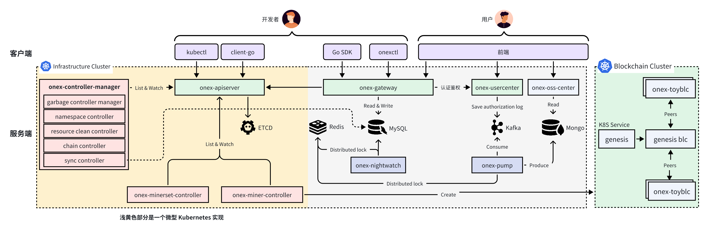

## OneX 架构介绍

OneX 架构图如下：

### OneX 平台使用流程

OneX 平台使用流程如下：
1. 用户登录：用户通过前端登录 OneX 平台，前端会调用 onex-usercenter提供的 RESTful API 接口登录系统，登录成功（用户名：密码验证成功），后端返回 Token，前端之后通过该 Token 跟后端交互。用户可以在控制台创建一个密钥对，用来访问 onex-gateway组件；
2. 创建矿机池：用户使用步骤 1 中，创建的密钥对，生成 JWT Token，来访问 onex-gateway组件创建矿机池，onex-gateway会根据请求信息，访问 onex-usercenter进行认证和授权，onex-usercenter会将授权记录保存在 Kafka 中。认证授权通过后，onex-gateway 会请求 onex-apiserver 创建 MinerSet 资源。onex-apiserver会将资源对象的参数保存到 Etcd 存储中；
3. 矿机池调和：onex-minerset-controller Watch onex-apiserver，当发现有新的MinerSet被创建后，会根据MinerSet.Spec参数，创建Miner资源，Miner资源的创建个数跟 MinerSet.Spec.Replicas设置的副本数保持一致。
4. 矿机调和：onex-miner-controller Watch onex-apiserver，当发现有新的Miner资源被创建时，会根据Miner.Spec参数，会使用 Kuberentes client-go 调用 kube-apiserver，创建 Pod 资源（一个 Pod 其实，就是一个矿机）；
5. 启动区块链节点：onex-miner-controller创建 Pod 时，会指定 Pod 的镜像和启动参数，镜像中包含一个onex-toyblc服务，该服务会启动一个区块链节点，并跟其他区块链节点进行通信，彼此发现；
6. 异步同步：onex-controller-manager中的sync-controller会 Watch onex-apiserver并将，Chain、MinerSet、Miner资源同步到 MySQL 数据库中。为什么要进行同步？是因为当onex-apiserver中资源太多时，使用 client-go 访问onex-apiserver延时会很高，所以提前将这些资源同步到 MySQL 中，onex-gateway通过 MySQL 来访问创建的资源，从而降低接口延时；
7. 异步处理：
  1. onex-pump会消费 Kafka 中的授权日志，经过解析、处理后保存到 MongoDB 中，onex-oss-center会查询 MongoDB 中的授权日志，来展示授权记录；
  2. onex-nightwatch是一个分布式异步任务处理服务，会异步执行注册的任务，例如，定期清理过期的密钥对等。
8. onex-controller-manager Controller 功能介绍：onex-controller-manager是一个 Controller 聚合服务，里面包含了多个 Controller，用来完成不同的功能：
  1. resource-clean-controller，用来定期将Chain、MinerSet、Miner资源从onex-apiserver中同步到 MySQL 中，确保数据的强一致性；
  2. chain-controller会 Watch onex-apiserver，当发现有新的 Chain资源被创建时，会创建一个私有创世链；
  3. garbage-controller-manager：GC 服务，定期删除需要 GC 的资源。

OneX 平台提供了多种途径用来访问后端组件，这些访问方式可以极大的提高开发/运维人员的开发/操作效率：
- kubectl：像访问 kube-apiserver一样，访问 onex-apiserver，使用方式完全保持一致；
- client-go：onex-apiserver的 Go 语言客户端，类似于 kubernetes 的 client-go，用来高效的访问onex-apiserver；
- Go SDK：onex-gateway的 gRPC 或 RESTful API 客户端，用来方便的访问 onex-gateway；
- onexctl：使用命令行工具访问onex-gateway，onexctl底层调用的是 onex-gateway的 Go SDK；
- 前端：前端控制台，可视化访问 OneX 平台。

### OneX 平台组件功能介绍

| 组件名 | 功能介绍 |
| :----: | :----: |
| kubectl | Kubernetes 命令行工具。访问 onex-apiserver 执行 OneX 内置资源的 CURD、Watch 等操作 |
| **client-go** | onex-apiserver 的 Go SDK |
| **Go SDK** | onex-gateway Go 语言 SDK |
| **onexctl** | OneX 平台的命令行工具。执行各类运营指令，简化运维，方便实现运维自动化 |
| 前端（未实现） | OneX 平台前端页面 |
| **onex-gateway** | OneX 管控流组件，平台后端统一入口组件。提供 HTTP/HTTPS/GRPC API 接口完成各类功能 |
| **onex-usercenter** | OneX 管控流组件。提供 HTTP/HTTPS/GRPC API 接口完成各类功能 |
| **onex-apiserver** | kube-apiserver 风格的 apiserver。提供标准的 RESTful API 接口，用来对 Chain、MinerSet、Miner、Event、ConfigMap、Namespace、Secret、Lease 等资源进行 CURD、Watch |
| **onex-nightwatch** | 分布式异步任务处理服务。作为 OneX 平台的异步任务处理引擎，执行各类异步任务 |
| **onex-pump** | ETL 数据抽取服务。用来消费 Kafka 中的授权日志，处理后保存到 Mongo 中，供运营中心查询展示 |
| onex-oss-center（未实现） | 运营中心。展示各类运营数据，执行各类运营操作，例如修改配额 |
| **onex-controller-manager** | OneX 项目的 Controller 聚合器。里面聚合了多种 Controller，用来完成不同的业务逻辑 |
| **onex-minerset-controller** | MinerSet 控制器。解析 MinerSet Spec，根据 Spec 创建符合声明的 Miner |
| **onex-miner-controller** | Miner 控制器。解析 Miner Spe，根据 Spec 创建 Blockchain Pod，也即矿机 |
| **onex-toyblc** | 区块链节点初始化器。用来启动一个私有区块链节点 |
| Etcd | onex-apiserver 后端存储 |
| Redis | 实现 Redis 分布式锁、保存授权日志、Key-Value 缓存、二级缓存 | 
| MySQL | 持久化存储 OneX 平台的各类数据。一期具有的表有：chain、miner、minerset、secret、user 等 |
| Kafka | 用来保存 onex-usercenter 产生的授权日志，供 onex-pump 消费 |
| Mongo | 用来保存清洗后端授权日志数据 |
| Infrastructure Cluster | OneX 组件部署所在的 Kubernetes 集群 |
| Blockchain Cluster | 矿机（Pod）所在的 Kubernetes 集群 |
| **onex-fakeserver** | 一个 Demo 模版服务，非线上组件，用来进行功能开发、测试、验证等 |
| **onex-cacheserver** | OneX 分布式缓存服务。已实现，未使用 |

